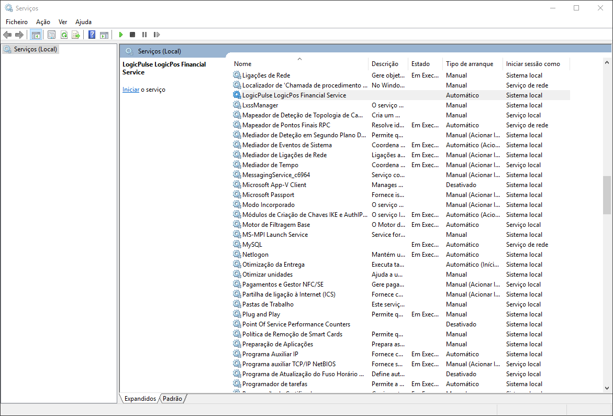
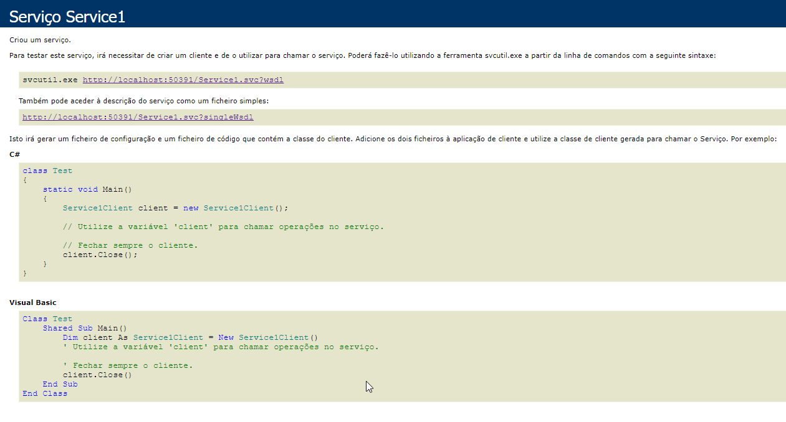
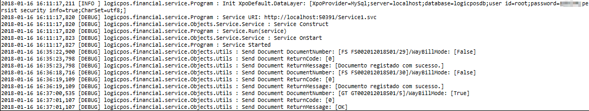

# Logicpulse LogicPos : Install Binary/Pre Compiled Version Quick Setup Notes

---
## Windows RunTime Requirements

1) Install [Microsoft .NET Framework 4.6.1](https://www.microsoft.com/pt-pt/download/details.aspx?id=49981)

2) [GTK 2.12.22+](https://www.gtk.org/download/index.php)

!!! note "Note"
    installer in folder `others\windowsruntime\gtk-sharp-2.12.22.msi`

3) Install GTK Nodoka Theme Engine

copy `others\windowsruntime\libnodoka.dll` to
   `c:\Program Files\GtkSharp\2.12\lib\gtk-2.0\2.10.0\engines\` (32bit), or 
   `c:\Program Files (x86)\GtkSharp\2.12\lib\gtk-2.0\2.10.0\engines\` (64bit)

4) Required to Restart Windows (GTK Runtime Requirement)

5) Now we can install/Run LogicPos

---
## Database Requirements

To work with LogicPos we need a data store, currently we can use [MySql Server](https://dev.mysql.com/downloads/mysql/), [Miscrosoft SqlServer](https://www.microsoft.com/pt-pt/sql-server/sql-server-downloads) or [Sqlite](https://sqlite.org/), bu technically we can use any data source comopatible with [eXpressPersistent Objects™ (XPO)](https://www.devexpress.com/products/net/orm/) 

!!! note "Note"
        - To work with [MySql Server](https://dev.mysql.com/downloads/mysql/) or [Miscrosoft SqlServer](https://www.microsoft.com/pt-pt/sql-server/sql-server-downloads) we need first to install server
        - To Work With [Sqlite](https://sqlite.org/) we dont need to install anything

!!! tip "Tip"
        - Recommended data sources: Mysql and SqlServer

--- 
## Configure LogicPos Database Connection

After we choose a data store we need to configure it in application config 

Open and edit config `logicpos\bin\Debug\logicpos.exe.config` 

**Configure Database**

1. **Option #1 : Mysql**

To work with **MySql** we need to edit `xpoConnectionString` to connect to local or remote **MySql Server Instance**

local

```xml
<add key="databaseType" value="MySql" />
<add key="xpoConnectionString" value="XpoProvider=MySql;server=localhost;database={0};user id=root;password=PASSWORD;persist security info=true;CharSet=utf8;" />
```

!!! note "Note"
    For remote server change `localhost` with remote ip, for ex `192.168.1.1`
    Dont forget to change `user id`, `password` according your needs.

2. **Option #2 : SqlServer**

To work with **SqlServer** we need to edit `xpoConnectionString` to point to our **SqlServer Server Instance**

local

```xml
<add key="databaseType" value="MSSqlServer" />
<add key="xpoConnectionString" value="XpoProvider=MSSqlServer;Data Source=SERVER\sql2008;Initial Catalog={0};User ID=sa;Password=PASSWORD;Persist Security Info=true;" />
```

!!! note "Note"
    Dont forget to change `user id`, `password` according your needs.

3. **Option #3 : SqlServer Express**

To work with **SqlServer Express** we need to edit `xpoConnectionString` to point to our **SqlServer Express Instance**, the connection string is a little diferent

```xml
<add key="databaseType" value="MSSqlServer" />
<add key="xpoConnectionString" value="XpoProvider=MSSqlServer;Data Source=.\SQLEXPRESS;Initial Catalog={0};User ID=mario.monteiro;Password=logicpulse#2014;Persist Security Info=true;Integrated Security=SSPI;Pooling=false;" />
```

4. Option #4 : Sqlite

```xml
<add key="databaseType" value="SQLite" />
<add key="xpoConnectionString" value="XpoProvider=MonoLite;uri=file:{0}.db" />
```

---
##  Run LogicPos

After **Configure LogicPos Database Connection** we can run LogicPos from `logicpos\bin\Debug\logicpos.exe` 

!!! tip"Tip"
    If we have problems running LogicPos we can look or tail the log locate at `logicpos\bin\Debug\logicpos.log`

---
## Install AT WebService from Binaries/Pre compiled

After successfully run LogicPos, we can setup AT WebServices to test with AT SandBox (Test Mode)

**Web Service Config Parameters**

`LogicposFinancialService.exe.config`

```xml
<!--Global|Shared for DC|WB-->
<add key="servicesATRequestTimeout" value="5000" /> <!--Default:5000|Disabled:-1-->
<add key="servicesATTestModeFilePublicKey" value="ChavePublicaAT.cer" />
<add key="servicesATTestModeFileCertificate" value="TesteWebservice.pfx" />
<add key="servicesATProdModeFilePublicKey" value="000000000_0000.cer" />
<add key="servicesATProdModeFileCertificate" value="000000000.pfx" />
<!--DC:Documents-->
<add key="servicesATDCTestMode" value="true" />
<!--WB:WayBill Documents-->
<add key="servicesATWBTestMode" value="true" />
<add key="servicesATWBAgriculturalMode" value="true" />
```

!!! note "Note"
    `ATProd` configs corresponds own company certificates, here are ommited with `000000000`

!!! note: "Note"
    Above config is working in test mode/sandbox, note the follow config parametes `servicesATDCTestMode`, `servicesATWBTestMode` and `servicesATWBAgriculturalMode` enabled with `true`, to enable production mode change `true` to `false` and put your own certificates in directory, and change filess in `servicesATProdModeFilePublicKey` and `servicesATProdModeFileCertificate`

**Windows Install Service**

!!! note "Note"
    - We need a full path to `LogicposFinancialService.exe` to install windows service, we can use `development environment` or `runtime`

    - Change path according your needs, for development environment use `logicpos\bin\Debug\Scripts\Win\AtWs\service_install.bat`, for runtime use `c:\Program Files (x86)\Logicpulse\logicpos\LogicposFinancialService.exe`

    - Default in `service_install.bat` is: 
    
    ```
    SC create logicpulselogicposfinancialservice displayname= "LogicPulse LogicPos Financial Service" binpath= "\"c:\SVN\logicpos\trunk\src\logicpos\logicpos_pos_opensource\logicpos\bin\Debug\LogicposFinancialService.exe\"" start= auto
    ```

1) Open a command line with adminstrator privileges and type above commands

```shell
cd c:\SVN\logicpos\trunk\src\logicpos\logicpos_pos_opensource\logicpos\bin\Debug\Scripts\Win\AtWs 
service_install.bat

[SC] CreateService SUCCESS
```

If service is installed succefully, we receive a `[SC] CreateService SUCCESS` return message, like we see above

2) Check if service is installed in windows, open windows services and find **LogicPulse LogicPos Financial Service**



2) We must assign a user to run the service, else we have error permissions **locating and use certificates**, press right mouse in service to pull context menu, and choose properties, next assign a user to service, using username and passoword


3) Test and Run Service, press right mouse in service to pull context menu, and choose start

4) Test Service Url [http://localhost:50391/Service1.svc](http://localhost:50391/Service1.svc)



**Uninstall, Start and Stop Bats**

To **Install**, **Unistall**, **Start** or **Stop** we can use above bats, or use windows services control pannel

```
logicpos.framework\logicpos.financial.service\Utils\service_start.bat
logicpos.framework\logicpos.financial.service\Utils\service_stop.bat
logicpos.framework\logicpos.financial.service\Utils\service_uninstall.bat
```

**Location of Certificates**

**AT WebService** requires certificates to work, currently the LogicPos distro has **TesteWebService** certificates pre installed in directory `Resources\Certificates`

ex

```
Resources\Certificates\508278155.pfx
Resources\Certificates\508278155_1115.bat
Resources\Certificates\508278155_1115.cer
Resources\Certificates\ChavePublicaAT.cer
Resources\Certificates\TesteWebservice.pfx
```

**Test/Enable AT WebService**

First edit webservice config files`LogicposFinancialService.exe.config` (runtime), or `logicpos.financial\logicpos.financial.service\App.config` (devenv) 
logicpos config files and change `serviceATSendDocuments` and `serviceATSendDocumentsWayBill` to true to enable send documents, else webservice ignore send documents, we need to change both configurations.

To test AT WebService, and after start windows service (above steps), we can launch LogicPos and emmit some **Financial** and **WayBill Documents**, they use a diferent endpoint in AT WebServices, its advised to test both

Again we can view/tail the log file, to expose whats appening with windows service, the log file is located in `logicpos.framework\logicpos.financial.service\bin\Debug\logicpos.financial.service.log`

we can use a tool like [baretail](https://www.baremetalsoft.com/baretail/) to tail the log

we can see service bootstrap like:

```
2018-04-17 10:44:00,748 [INFO ] logicpos.financial.service.Program : Init XpoDefault.DataLayer: [XpoProvider=MySql;server=localhost;database=logicposdb;user id=root;password=admin#;persist security info=true;CharSet=utf8;]
2018-04-17 10:44:02,210 [DEBUG] logicpos.financial.service.Objects.Utils : BootStrap Framework Console Service Project....
2018-04-17 10:44:02,210 [DEBUG] logicpos.financial.service.Objects.Utils : ServicesATEnableTestMode: [True]
2018-04-17 10:44:02,211 [DEBUG] logicpos.financial.service.Program : Service URI: http://localhost:50391/Service1.svc
2018-04-17 10:44:02,211 [DEBUG] logicpos.financial.service.Objects.Utils : Launch service? [Y or Enter] or any other key to run in interactive develop/debug mode
2018-04-17 10:47:25,521 [INFO ] logicpos.financial.service.Program : Init XpoDefault.DataLayer: [XpoProvider=MySql;server=localhost;database=logicposdb;user id=root;password=admin#;persist security info=true;CharSet=utf8;]
2018-04-17 10:47:26,141 [DEBUG] logicpos.financial.service.Objects.Utils : BootStrap Framework Console Service Project....
2018-04-17 10:47:26,141 [DEBUG] logicpos.financial.service.Objects.Utils : ServicesATEnableTestMode: [True]
2018-04-17 10:47:26,141 [DEBUG] logicpos.financial.service.Program : Service URI: http://localhost:50391/Service1.svc
2018-04-17 10:47:26,141 [DEBUG] logicpos.financial.service.Objects.Service.Service : Service Construct
2018-04-17 10:47:26,141 [DEBUG] logicpos.financial.service.Program : Service.Run(service)
2018-04-17 10:47:26,144 [DEBUG] logicpos.financial.service.Objects.Service.Service : Service OnStart
2018-04-17 10:47:26,161 [DEBUG] logicpos.financial.service.Program : Service Started
2018-04-17 10:47:26,162 [DEBUG] logicpos.financial.service.Objects.Utils : ModifyHttpSettings: 'netsh http add urlacl url=http://+:50391/ user=\Todos'
```

**Start Service Log and Emmit Some Financial Invoices Documents**



**log**

```
Send Document DocumentNumber: [FS FS002012018S01/29]/WayBillMode: [False]
Send Document ReturnCode: [0]
Send Document ReturnMessage: [Documento registado com sucesso.]
Send Document DocumentNumber: [FS FS002012018S01/30]/WayBillMode: [False]
Send Document ReturnCode: [0]
Send Document ReturnMessage: [Documento registado com sucesso.]
Send Document DocumentNumber: [GT GT002012018S01/5]/WayBillMode: [True]
Send Document ReturnCode: [0]
Send Document ReturnMessage: [OK]
```

If everything is Ok we can see that we have communication with TestMode WebService in above log and dont have any errors. ex `Send Document ReturnMessage: [OK]`

---
## AT WebService problem Resolution

Sometimes we can get some problems like:

**Wrong database in Config**


If we get errors with invalid documents, the cause can be wrong database configuration, sometimes we change default database name `logicposdb` in development environment, both logicpos and webservice must be using same database, else webservice cant find document in database, to fix this use same database name in logicpos and webservice

**log**

```
2018-04-17 11:42:55,808 [DEBUG] logicpos.financial.service.Objects.Utils : Error 202: [Documento Inválido: 321a84c4-677a-4ea1-a024-860e87a960e1]
```

Correct the database name on SettingsApp.cs on both projects

```csharp
public static string DatabaseName = "logicposdb";
```

### Problems With Expired Certificate

Sometimes we get this type of error in logs

```
2018-04-17 12:30:57,035 [DEBUG] logicpos.financial.service.Objects.Utils : Send Document DocumentNumber: [FS FS008012018S01/1]/WayBillMode: [False]
2018-04-17 12:30:57,120 [DEBUG] logicpos.financial.service.Objects.Utils : Cert Subject: [CN=TesteWebServices, OU=ASI, O=AT - Autoridade Tributaria e Aduaneira, L=Lisboa, S=Lisboa, C=PT], NotBefore: [02/08/2017 15:06:39], NotAfter: [29/01/2018 14:06:39]
2018-04-17 12:30:57,329 [ERROR] logicpos.financial.service.Objects.Modules.AT.ServicesAT : A ligação subjacente foi fechada: Erro inesperado ao enviar.
System.Net.WebException: A ligação subjacente foi fechada: Erro inesperado ao enviar. ---> System.IO.IOException: Falha da autenticação porque a parte remota fechou a sequência de transporte.
   em System.Net.Security.SslState.StartReadFrame(Byte[] buffer, Int32 readBytes, AsyncProtocolRequest asyncRequest)
....   
2018-04-17 12:30:57,397 [DEBUG] logicpos.financial.service.Objects.Utils : Exception: [A ligação subjacente foi fechada: Erro inesperado ao enviar.]
2018-04-17 12:30:57,511 [DEBUG] logicpos.financial.service.Objects.Utils : Error 200: [A ligação subjacente foi fechada: Erro inesperado ao enviar.]
```
The cause is that Test certificates has been expired `NotBefore: [02/08/2017 15:06:39], NotAfter: [29/01/2018 14:06:39]`

When this occur we must login in [faturas.portaldasfinancas.gov.pt](https://faturas.portaldasfinancas.gov.pt) and **download updated certicates**


We can get certificates from this link [certificados.zip](https://faturas.portaldasfinancas.gov.pt/factemipf_static/java/certificados.zip) or go to [certificados link](https://faturas.portaldasfinancas.gov.pt/testarLigacaoWebService.action#certificados)

After we download certificados.zip we must extract to Runtime/Development folders to update old expired certificates, but first we must stop windows service, to prevent above error replacing certificate


1) extract and copy 

```
TesteWebServices.pfx > Resources\Certificates\TesteWebService.pfx
Chave Cifra Publica AT (Produção).cer > Resources\Certificates\ChavePublicaAT.cer
```

!!! warning "Warning"
    Filenames are diferent from target filenames, and note that we removed last **[s]** from TesteWebService**[s]**.pfx

2) Restart windows service and test again

### Launch Service at Command Line

Sometimes Service wont Run, and we need to see why, we can launch service ate console to check for errors


```
cd c:\Program Files (x86)\Logicpulse\logicpos

LogicposFinancialService.exe

Unable to open database. Connection string: 'server=DB_SERVER;user id=DB_USER;password=***REMOVED***;database=logicposdb;persistsecurityinfo=True;characterset=utf8;'; Error: 'MySql.Data.MySqlClient.MySqlException (0x80004005): Unable to connect to any of the specified MySQL hosts. ---> System.Net.Sockets.SocketException (0x80004005): Este anfitrião não é conhecido
   em System.Net.Dns.GetAddrInfo(String name)
   em System.Net.Dns.InternalGetHostByName(String hostName, Boolean includeIPv6)
   em System.Net.Dns.GetHostEntry(String hostNameOrAddress)
   em MySql.Data.Common.MyNetworkStream.CreateStream(MySqlConnectionStringBuilder settings, Boolean unix)
   em MySql.Data.Common.StreamCreator.GetStream(MySqlConnectionStringBuilder settings)
   em MySql.Data.MySqlClient.NativeDriver.Open()
   em MySql.Data.MySqlClient.NativeDriver.Open()
   em MySql.Data.MySqlClient.Driver.Open()
   em MySql.Data.MySqlClient.Driver.Create(MySqlConnectionStringBuilder settings)
   em MySql.Data.MySqlClient.MySqlPool.GetPooledConnection()
   em MySql.Data.MySqlClient.MySqlPool.TryToGetDriver()
   em MySql.Data.MySqlClient.MySqlPool.GetConnection()
   em MySql.Data.MySqlClient.MySqlConnection.Open()
   em DevExpress.Xpo.DB.MySqlConnectionProvider.CreateDataBase()'
Press any key...
```

Here we see that we have a wrong Connection String, fix `LogicposFinancialService.exe.config`, and start service again
